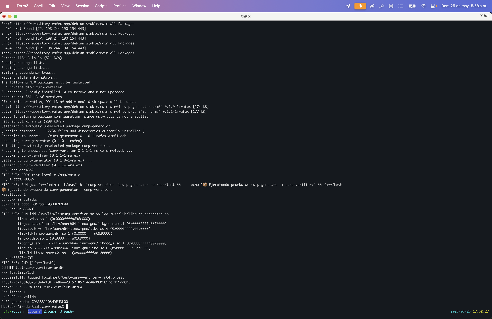

# curp_generator

> Versión actual: 0.1.0-1+rafex

Este proyecto implementa en Rust el algoritmo para **generar CURP válidas estructuralmente**, conforme a lo estipulado en el [Instructivo Normativo para la Asignación de la Clave Única de Registro de Población](https://sre.gob.mx/component/phocadownload/category/2-marco-normativo?download=1116:instructivo-normativo-para-la-asignacion-de-la-clave-unica-de-registro-de-poblacion-dof-18-10-2021-texto-vigente), publicado oficialmente en el Diario Oficial de la Federación (DOF) el 18 de octubre de 2021.

## Estructura de la CURP

La CURP es una clave alfanumérica de 18 caracteres generada a partir de:

1. Inicial del primer apellido + primera vocal interna.
2. Inicial del segundo apellido.
3. Inicial del primer nombre (se ignora "María"/"José" si hay segundo nombre).
4. Fecha de nacimiento: AAMMDD.
5. Sexo: H o M.
6. Entidad federativa (2 letras).
7. Primeras consonantes internas del primer apellido, segundo apellido y nombre.
8. Dígito para el siglo (0–9 antes del 2000, A–Z después).
9. Dígito verificador calculado conforme al instructivo.

## ⚠️ Advertencia

Este software es únicamente con fines educativos y de prueba. La CURP generada **no sustituye a la oficial** emitida por RENAPO.

## Instalación (vía APT)

```bash
echo "deb [trusted=yes] https://repository.rafex.app/debian stable main" > /etc/apt/sources.list.d/rafex.list
sudo apt update
sudo apt install curp-generator
```

## Verificación opcional de integridad y autenticidad

Si descargaste el `.deb` directamente, puedes verificar su integridad y firma:

```bash
curl -O https://repository.rafex.app/debian/curp-generator_0.1.0-1+rafex_amd64.deb
curl -O https://repository.rafex.app/debian/curp-generator_0.1.0-1+rafex_amd64.deb.sig
curl -O https://repository.rafex.app/pubkey.asc

# Importar la clave pública
gpg --import pubkey.asc

# Verificar la firma
gpg --verify curp-generator_0.1.0-1+rafex_amd64.deb.sig curp-generator_0.1.0-1+rafex_amd64.deb
```

También puedes verificar el hash SHA256 (si está disponible):

```bash
curl -O https://repository.rafex.app/debian/curp-generator_0.1.0-1+rafex_amd64.deb.sha256
sha256sum -c curp-generator_0.1.0-1+rafex_amd64.deb.sha256
```

## Verificación de instalación



## Ejemplo en C

```c
#include <stdio.h>
#include "curp_generator.h"

int main() {
    struct DatosPersonales persona = {
        .nombre = "RAUL EDUARDO",
        .primer_apellido = "GONZALEZ",
        .segundo_apellido = "ARGOTE",
        .sexo = 'H',
        .fecha_nacimiento = "1988-11-03",
        .entidad = "DF"
    };

    char* curp = generar_curp_c(&persona);
    printf("CURP generada: %s\n", curp);
    return 0;
}
```
