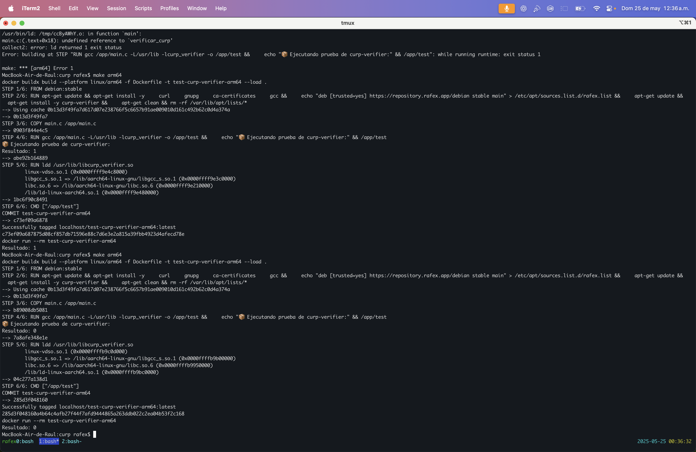

# curp_verifier

> Versión actual: 0.1.1-1+rafex

Este proyecto implementa en Rust el algoritmo de verificación del **dígito verificador de la CURP**, conforme a lo estipulado en el [Instructivo Normativo para la Asignación de la Clave Única de Registro de Población](https://curp.readthedocs.io/es/latest/instructivo/verificacion.html) y publicado oficialmente en el Diario Oficial de la Federación (DOF) el 18 de octubre de 2021.

## Origen de la especificación

El algoritmo que usamos está sustentado por:
- [Instructivo en línea](https://curp.readthedocs.io/es/latest/instructivo/verificacion.html)
- [DOF 18-10-2021 - Instructivo Normativo para la Asignación de la CURP](https://sre.gob.mx/component/phocadownload/category/2-marco-normativo?download=1116:instructivo-normativo-para-la-asignacion-de-la-clave-unica-de-registro-de-poblacion-dof-18-10-2021-texto-vigente)

## Algoritmo del dígito verificador (resumen)

La CURP es una clave alfanumérica de 18 caracteres. El **último carácter (posición 18)** se calcula con base en los primeros 17 mediante una suma ponderada, como sigue:

1. A cada carácter se le asigna un valor numérico según una tabla de equivalencias.
2. Cada valor se multiplica por su peso, decreciendo desde 17 hasta 1.
3. Se suman los productos.
4. Se obtiene el residuo de la división entre 10.
5. El dígito verificador es `0` si el residuo es `0`; en otro caso, es `10 - residuo`.

Este dígito sirve para validar que la CURP no tenga errores de captura.

## Tabla de equivalencias usada (extraída del instructivo del DOF)

| Carácter | Valor |
|----------|-------|
| 0-9      | 0-9   |
| A        | 10    |
| B        | 11    |
| C        | 12    |
| D        | 13    |
| E        | 14    |
| F        | 15    |
| G        | 16    |
| H        | 17    |
| I        | 18    |
| J        | 19    |
| K        | 20    |
| L        | 21    |
| M        | 22    |
| N        | 23    |
| Ñ        | 24    |
| O        | 25    |
| P        | 26    |
| Q        | 27    |
| R        | 28    |
| S        | 29    |
| T        | 30    |
| U        | 31    |
| V        | 32    |
| W        | 33    |
| X        | 34    |
| Y        | 35    |
| Z        | 36    |

## ⚠️ Advertencia

Este software se proporciona con fines prácticos y educativos únicamente. Su implementación del algoritmo de validación del dígito verificador de la CURP se basa en fuentes oficiales públicas, pero **no sustituye en ningún momento la funcionalidad ni validez del portal oficial del gobierno mexicano** disponible en: [https://www.gob.mx/curp/](https://www.gob.mx/curp/)

Para obtener tu CURP oficial o validar registros con validez jurídica, consulta directamente el sitio oficial.

Nota: Aunque la estructura parece correcta, solo RENAPO puede confirmar su validez oficial.

## Instalación

### Agregar repositorio APT (Debian/Ubuntu)

```bash
#curl -fsSL https://repository.rafex.app/rafex.gpg | sudo gpg --dearmor -o /usr/share/keyrings/rafex-archive-keyring.gpg
#echo "deb [signed-by=/usr/share/keyrings/rafex-archive-keyring.gpg] https://repository.rafex.app/debian stable main" | sudo tee /etc/apt/sources.list.d/rafex.list > /dev/null
echo "deb [trusted=yes] https://repository.rafex.app/debian stable main" > /etc/apt/sources.list.d/rafex.list
sudo apt update
sudo apt install curp-verifier
```

### Verificación de instalación



## Verificación opcional de integridad y autenticidad

Si descargaste el `.deb` directamente, puedes verificar su integridad y firma:

```bash
curl -O https://repository.rafex.app/debian/curp-verifier_0.1.1-1+rafex_amd64.deb
curl -O https://repository.rafex.app/debian/curp-verifier_0.1.1-1+rafex_amd64.deb.sig
curl -O https://repository.rafex.app/pubkey.asc

# Importar la clave pública
gpg --import pubkey.asc

# Verificar la firma
gpg --verify curp-verifier_0.1.1-1+rafex_amd64.deb.sig curp-verifier_0.1.1-1+rafex_amd64.deb
```

También puedes verificar el hash SHA256 (si está disponible):

```bash
curl -O https://repository.rafex.app/debian/curp-verifier_0.1.1-1+rafex_amd64.deb.sha256
sha256sum -c curp-verifier_0.1.1-1+rafex_amd64.deb.sha256
```

### Ejemplo en C

```c
#include <stdio.h>

extern int verify_curp(const char* curp); // o el nombre real de tu función

int main() {
    //const char* prueba = "GOCJ850528HDFRNL08";  // CURP inválida
    const char* prueba = "GOAR881103HDFNRL04";  // CURP válida
    int valido = verify_curp(prueba);
    printf("Resultado: %d\n", valido);
    return 0;
}
```

